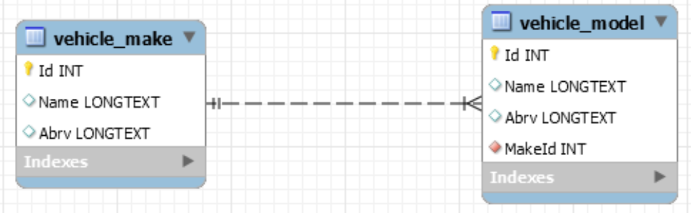

# Software architecture
## Layered (N-Tier) Architecture
  1. Data Tier - as MySQL Relational Database
  2. Logic Tier - as .NET Core REST API
  3. Presentation Tier - as ASP.NET MVC web application

### 1. Data Tier
Based on MySQL relational database.  
Folder: Project.Service

  * ER(Entity-Relationship) model
  

---
### 2. Logic Tier
Based on ASP.NET Core API (Project.MVC/Controllers)  
**API routes:**  
  *[Routes details documentation](./Project.MVC/routes.md)* 

  Route structure logic: {apiPrefix}/{controller} 
  * Public routes:  
  **AdministrationController** routes:  
  Route base: **api/administration**  
  Features:  
    * Makes: 
      * CRUD operations on makes
      * Sort query: by Name and Abrv properties  
    * Models
      * CRUD operations on models
      * Sort query: by Name and Abrv properties
   
     
### 3. Presentation Tier
Based on ASP.NET Core Web App (Model-View-Controller)
  * Class diagram
    * Administration view model 

  * UI mockups:
    * Administration view
    

