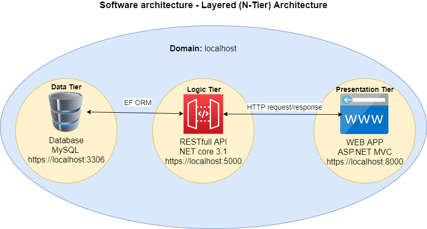
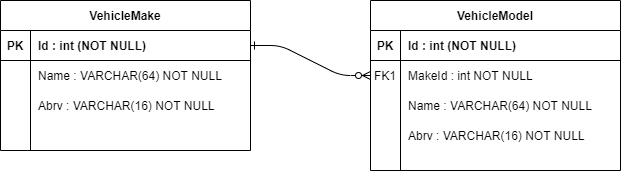
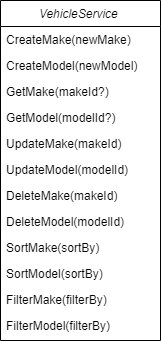
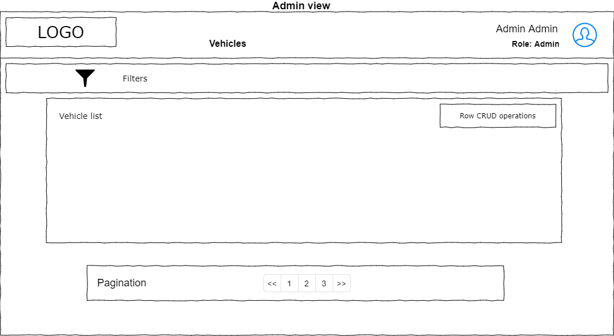

# Software architecture
## Layered (N-Tier) Architecture
  1. Data Tier - as MySQL Relational Database
  2. Logic Tier - as .NET Core REST API
  3. Presentation Tier - as ASP.NET MVC web application

### 1. Data Tier
Based on MySQL relational database.
  * ER(Entity-Relationship) model
  

### 2. Logic Tier
Based on ASP.NET Core Web API
  * Class diagram

    

### 3. Presentation Tier
Based on ASP.NET Core Web App (Model-View-Controller)
  * Class diagram
    * Administration view model 

  * UI mockups:
    * Administration view
    
